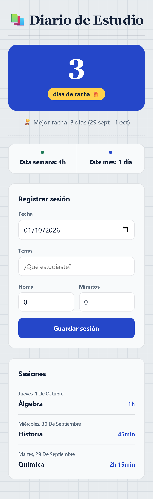

# 📚 Diario de Estudio

Aplicación web sencilla para registrar tus sesiones de estudio y ver tu racha,
tus horas y los días que has estudiado. Funciona directamente en el navegador,
sin instalar nada.

## Qué hace

- Registra sesiones con fecha, tema y tiempo (horas + minutos).
- Calcula la **racha actual** de días consecutivos.
- Muestra la **mejor racha** histórica con su rango de fechas.
- Suma el **tiempo de la semana** (de lunes a hoy).
- Cuenta los **días estudiados este mes**.
- Lista el historial de sesiones.

## Cómo usarla

1. Descarga o clona el repositorio.
2. Abre `index.html` con doble clic. No hace falta servidor ni instalar nada.
3. Rellena el formulario y pulsa "Guardar sesión".

Tus datos se guardan en el navegador (`localStorage`), no en ningún servidor.

**Empezar de cero:** abre DevTools (F12) → Application → Local Storage y borra
la clave `sesiones`.

## Cómo funciona por dentro

- Sin backend, sin dependencias y sin paso de build: HTML, CSS y JavaScript puros.
- Tres archivos: `index.html`, `styles.css` y `app.js`.
- Los datos se guardan en `localStorage` bajo la clave `sesiones`.

## Reglas de fechas

Las fechas son la mayor fuente de errores, así que se tratan con cuidado:

- Se guardan como texto `"AAAA-MM-DD"` en la **hora local** del usuario.
- Nunca se usa `toISOString()` ni `new Date("AAAA-MM-DD")`: se interpretan en UTC
  y desplazan el día.
- Las sesiones con fecha futura no cuentan para ninguna racha.
- Varias sesiones el mismo día cuentan como un solo día.
- La semana empieza en **lunes**.

## Desarrollo

- No hay tests automáticos. Después de cada cambio, se verifica con Chrome
  DevTools: abre `index.html`, prueba la funcionalidad, revisa la consola y
  comprueba la vista móvil.
- Consulta `AGENTS.md` para las reglas del proyecto y `MEMORY.md` para el estado
  actual y las decisiones tomadas.

## Estructura del repositorio

| Archivo | Qué es |
|---|---|
| `index.html` | Estructura de la interfaz |
| `styles.css` | Estilos |
| `app.js` | Lógica (racha, semana, mes, almacenamiento) |
| `AGENTS.md` | Reglas para los agentes |
| `MEMORY.md` | Memoria del proyecto entre sesiones |
| `docs/constitution.md` | Principios innegociables del proyecto |
| `specs/` | Especificaciones, planes y tareas por funcionalidad |
| `docs/captura-movil.png` | Captura de la vista móvil |

## Historial de cambios

Cada commit relevante se anota aquí (el más reciente primero).

| Fecha | Cambio |
|---|---|
| 2026-10-01 | Decisión: el historial de cambios vive en el README (sin `CHANGELOG.md`), con regla de poda. |
| 2026-10-01 | Constitución del proyecto, regla de historial en `AGENTS.md` y actualización del README. |
| 2026-10-01 | Spec, plan y tareas del mapa de calor (`specs/001-heat-map/`). |
| 2026-10-01 | README con captura de la vista móvil y corrección de la clave de localStorage en `AGENTS.md`. |
| 2026-10-01 | Registro del versionado en Git y avisos de seguridad en `MEMORY.md`. |
| 2026-10-01 | Versión inicial: sesiones, racha, mejor racha, tiempo semanal y días del mes. |
